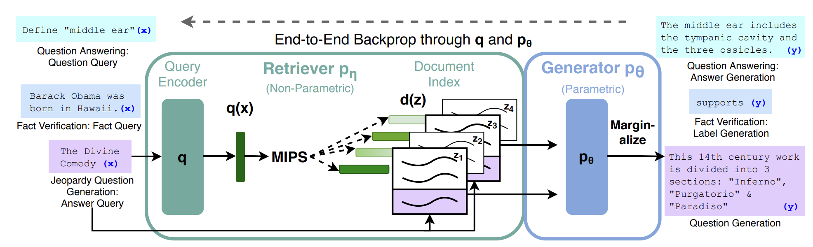

# Retrieval-Augmented Generation for knowledge-intensive NLP tasks

Facebook Research [paper link](https://arxiv.org/pdf/2005.11401)

## Abstract
LLM problem: (based on 2021) 
1. Access and precisely manipulate knowledge is still limited. 
2. Updating knowledge is hard

RAG: 
- pre-trained parametric memory: pretrained seq2seq model 
[[RNN encoder-decoder paper](https://arxiv.org/pdf/1406.1078)] encoder:sequence to **c** / decoder: **c** to sequence
[[seq2seq](https://arxiv.org/pdf/1409.3215v3)]
- non-parametric memory: dense vector index of Wiki

Out performing NLP tasks:
- Open-domain QA
- Abstractive QA
- Jeopardy Question Generation
- Fact Verifation

## 1. Introduction

Pre-trained Neural Language Models: 
- Cannot easily expand or revise their memory
- May produce "Hallucianations"

Hybrid Models: Knowkedge can be derictly revised and expanded
- [REALM](https://arxiv.org/pdf/2002.08909) and [ORQA](https://arxiv.org/pdf/1906.00300) (What are they and their difference?)
- FB AI research team bring the hybrid model to the "Workhorse of NLP" => Seq2seq model

General-purpose fune-tning approach -> RAG!!!

### RAG structure:
Retriver + Generator

#### Retriever:
[Dense Passage Retriever](https://arxiv.org/pdf/2004.04906) (DPR)
#### Generator:
- per output basis RAG-S
- per token basis RAG-T
### Tasks
knowledge-intensive tasks:
- NQ: open Natural Questions
- WQ: WebQuestions
- CT: CuratedTrec

Knowledge-intensive generation:
- MS-MARCO
- Jeopardy question

Fact Verification:
- FEVER
## 2. Methods

### 2.1 Models
- RAG-Sequence Model: uses the same retrieved document to generate the complete sequence
- RAG-Token Model: allaw different latent document for each target token.
- note: for sequence classification tasks, RAG-S and RAG-T are equivalent

### 2.2 Retriever : DPR
- bi-encoder architecture
- `p(z|x) ∝ exp(d(z)Tq(x))`; d(z) is a BERT document encoder; q(x) is a BERT query encoder
- calculate top k of `p(.|x)` by Maximum Inner Product Search(MIPS)
### 2.3 Generator : BERT
- can be any encoder-decoder structure
- use BERT-large here
- pre-trained using a denoising objective
### 2.4 Training
- no direct supervision
- minimize `sum(-log(p(yi|xi)))` using stochastic gradient descent with Adam
### 2.5 Decoding
approximate `argmax p(y|x)`
- RAG-Sequence Model: standard beam search
- RAG-Token Model: run beam search for each document z, and scoring each hypothesis. -> Fast Decoding
## 3. Experiments
> Setting:
> - Use a single Wikipedia dump
> - spilt each artical into 100-word chunks
> - Build a single MIPS index using FAISS
> - Set k in {5,10}

## 4. Results
The work presented showcases RAG models which obtain state-of-the-art results in open-domain question answering, showcasing their superiority over current models through not only enhanced performance metrics across several tasks but also by generating more factual and specific responses as evaluated by human evaluators. By employing a blend of parametric and non-parametric memory, RAG models provide a robust framework that is not only capable of generating correct answers when direct evidence is missing but also improves factual correctness and diversity in generated answers.

## 5. Related work
The literature review highlights that integrating retrieval with natural language processing tasks improves performance significantly, even when considered individually. Previously, different tasks utilized separate retrieval-based models to improve outcomes. Contrary to using standalone pre-trained models without retrieval, such as GPT-2 or T5, the incorporation of a retrieval module enhances performance across varied tasks by effectively augmenting the existing knowledge base of the model.

## 6. Discussion
The discussions reveal insights into RAG's enhanced effectiveness, attributable to its hybrid use of retrieval-augmented generation, which enriches the model's capacity to generate high-quality answers. Furthermore, the adaptability of RAG is emphasized through its "index hot-swapping" capability, allowing the model to remain pertinent with updates in real-time knowledge without retraining. Possible future directions include exploring the joint pre-training of the retrieval and generation components and expanding the applicability to broader NLP tasks, potentially setting a new benchmark in the integration of retrieval mechanisms within language models.

